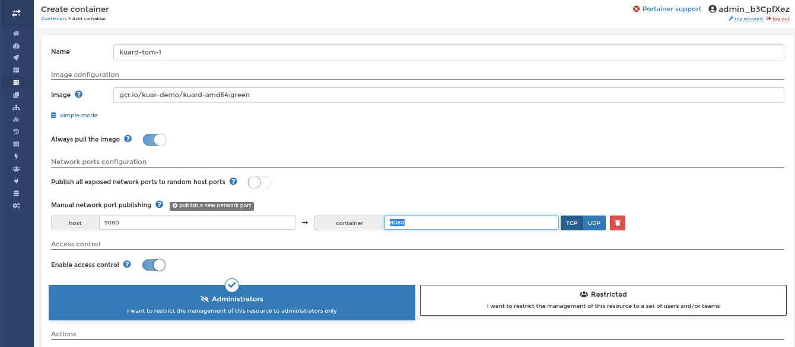
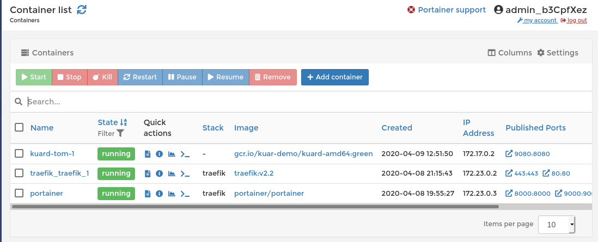

# Trying out chapter 2 exercises

## First with the cli

After SSH'ing into the server with the ``lab`` user run the following command to
start the container:

```
sudo docker run -d --name kuard-tom-1 \
       --publish 9080:8080 \
       gcr.io/kuar-demo/kuard-amd64:blue
```

You may want to change the following parts to make your container unique:

- **kuard-tom-1** - This is the name of the container. You can change it to anything
  you want.
- **9080:8080** - Here we're mapping the host's port (the part to the left of the
  colon) with the container's port (the part on the right). The **right** part
  shouldn't change, but the left part can be any unused port on the host.

Now let's port forward to be able to see it. Run this command on *your* machine to
create an SSH tunnel between your machine and the server:

    $ ssh -L 9080:bookclub.tompurl.com:9080 lab@bookclub.tompurl.com
    
Let's explain the components here:

    - **9080 (on the left side)** - This is the port that you will access on **your** machine.
    - **9080 (on the right side)** - This is the port that you want to access on the **remote server**

If you're on Windows then check out the following tutorial:

    - <https://docs.bitnami.com/bch/faq/get-started/access-ssh-tunnel/>
    
Once you execute the command you'll see something like this in your terminal
(e.g. Putty):

    X11 forwarding request failed on channel 2
    Linux bookclub.tompurl.com 4.19.0-8-cloud-amd64 #1 SMP Debian 4.19.98-1 (2020-01-26) x86_64
    ...
    Debian GNU/Linux comes with ABSOLUTELY NO WARRANTY, to the extent
    permitted by applicable law.
    Last login: Thu Apr  9 17:23:12 2020 from 73.246.77.226
    lab@bookclub:~$ 
    
Now **without closing that terminal** you can access the app **on your local
machine** using the following URL:

-   <http://localhost:9080>

## Now with Portainer!

Here's some optional instructions on doing the same thing with Portainer. In my
opinion this is slightly more difficult but people seem to like graphical front-ends
:-) Also, Portainer is an awesome tool that is fun to play with.

Here's how I configured my container after clicking on **Containers -> Add Container**:



If you can't see a config option then I used the default values.

I then saw something like this in the **Containers** menu:



Now you can test the installation by using the port forwarding instructions above.
